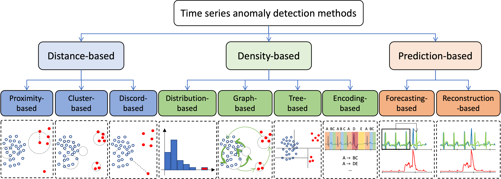

<h1 align="center">TSB-kit</h1>
<h2 align="center">Univariate Time-Series Anomaly Detection algorithms from TSB-UAD benchmark</h2>
<div align="center">
<p>
   
</p>
</div>


TSB-kit is a library of univariate time-series anomaly detection methods from the [TSB-UAD benchmark](https://github.com/TheDatumOrg/TSB-UAD). Overall, TSB-kit
contains 13 anomaly detection methods, and 15 evaluation measures. This is a joint initiative between Inria, Ecole Normale Supérieure, Ohio State University and Université Paris Cité.
If you use TSB-kit in your project or research, cite the following two papers:

* [VLDB 2022a](https://www.paparrizos.org/papers/PaparrizosVLDB22a.pdf)
* [VLDB 2022b](https://www.paparrizos.org/papers/PaparrizosVLDB22b.pdf)

### References

> "TSB-UAD: An End-to-End Benchmark Suite for Univariate Time-Series Anomaly Detection"<br/>
> John Paparrizos, Yuhao Kang, Paul Boniol, Ruey Tsay, Themis Palpanas, and Michael Franklin.<br/>
> Proceedings of the VLDB Endowment (**PVLDB 2022**) Journal, Volume 15, pages 1697–1711<br/>

```bibtex
@article{paparrizos2022tsb,
  title={Tsb-uad: an end-to-end benchmark suite for univariate time-series anomaly detection},
  author={Paparrizos, John and Kang, Yuhao and Boniol, Paul and Tsay, Ruey S and Palpanas, Themis and Franklin, Michael J},
  journal={Proceedings of the VLDB Endowment},
  volume={15},
  number={8},
  pages={1697--1711},
  year={2022},
  publisher={VLDB Endowment}
}
```

> "Volume Under the Surface: A New Accuracy Evaluation Measure for Time-Series Anomaly Detection"<br/>
> John Paparrizos, Paul Boniol, Themis Palpanas, Ruey Tsay, Aaron Elmore, and Michael Franklin<br/>
> Proceedings of the VLDB Endowment (**PVLDB 2022**) Journal, Volume 15, pages 2774‑2787<br/>

```bibtex
@article{paparrizos2022volume,
  title={{Volume Under the Surface: A New Accuracy Evaluation Measure for Time-Series Anomaly Detection}},
  author={Paparrizos, John and Boniol, Paul and Palpanas, Themis and Tsay, Ruey S and Elmore, Aaron and Franklin, Michael J},
  journal={Proceedings of the VLDB Endowment},
  volume={15},
  number={11},
  pages={2774--2787},
  year={2022},
  publisher={VLDB Endowment}
}

```

> "Local Evaluation of Time Series Anomaly Detection Algorithms", 
> Accepted in KDD 2022 Research Track: Proceedings of the 28th ACM SIGKDD Conference on Knowledge Discovery and Data Mining.
>  [Affiliation Metrics](https://github.com/ahstat/affiliation-metrics-py)

## Contributors

* Paul Boniol (Inria, ENS)
* John Paparrizos (Ohio State University)
* Emmanouil Sylligardos (Inria, ENS)
* Yuhao Kang (University of Chicago)
* Alex Wu (University of Chicago)
* Teja Bogireddy (University of Chicago)
* Themis Palpanas (Université Paris Cité)

## Installation

The following tools are required to install TSB-kit from source:

- git
- conda (anaconda or miniconda)

#### Steps

1. You can download the datasets of TSB-UAD using the following links:

- Public: https://www.thedatum.org/datasets/TSB-UAD-Public.zip

- Synthetic: https://www.thedatum.org/datasets/TSB-UAD-Synthetic.zip

- Artificial: https://www.thedatum.org/datasets/TSB-UAD-Artificial.zip

- - The UCR classification datasets used to generate the Artificial datasets: https://www.thedatum.org/datasets/UCR2022_DATASETS.zip

2. Clone this repository using git and change into its root directory.

```bash
git clone https://github.com/boniolp/tsb-kit.git
cd tsb-kit/
```

3. Create and activate a conda-environment 'tsb-kit'.

```bash
conda env create --file environment.yml
conda activate tsb-kit
```

4. Install TSB-kit:

```
pip install .
```

## Anomaly Detectors

We use 13 anomaly detection methods proposed for univariate time series. the following table lists and describes the methods considered in our benchmark:

<p align="center">

</p>

| Anomaly Detection Method    | Description|
|:--|:---------:|
|Isolation Forest (IForest) | This method constructs the binary tree based on the space splitting and the nodes with shorter path lengths to the root are more likely to be anomalies. |
|The Local Outlier Factor (LOF)| This method computes the ratio of the neighboring density to the local density. |
|The Histogram-based Outlier Score (HBOS)| This method constructs a histogram for the data and the inverse of the height of the bin is used as the outlier score of the data point. |
|Matrix Profile (MP)| This method calculates as anomaly the subsequence with the most significant 1-NN distance. |
|NORMA| This method identifies the normal pattern based on clustering and calculates each point's effective distance to the normal pattern. |
|Principal Component Analysis (PCA)| This method projects data to a lower-dimensional hyperplane, and data points with a significant distance from this plane can be identified as outliers. |
|Autoencoder (AE)|This method projects data to the lower-dimensional latent space and reconstructs the data, and outliers are expected to have more evident reconstruction deviation. |
|LSTM-AD| This method build a non-linear relationship between current and previous time series (using Long-Short-Term-Memory cells), and the outliers are detected by the deviation between the predicted and actual values. |
|Polynomial Approximation (POLY)| This method build a non-linear relationship between current and previous time series (using polynomial decomposition), and the outliers are detected by the deviation between the predicted and actual values. |
| CNN | This method build a non-linear relationship between current and previous time series (using convolutional Neural Network), and the outliers are detected by the deviation between the predicted and actual values. |
|One-class Support Vector Machines (OCSVM)| This method fits the dataset to find the normal data's boundary. |
|*Discord Aware Matrix Profile (DAMP)*| *This method is a scalable matrix Profile-based approach proposed to solves the twin-freak problem.* |
|*SAND*| *This method identifies the normal pattern based on clustering updated through arriving batches (i.e., subsequences) and calculates each point's effective distance to the normal pattern. This method can be used either online and offline.* |
|*Series2Graph*| *This method is converting the time series into a directed graph reprenting the evolution of subsequences in time. The anomalies are detected using the weight and the degree of the nodes and edges respectively.* |

You may find more details (and the references) in our [paper](https://www.paparrizos.org/papers/PaparrizosVLDB22b.pdf). In italics are methods that are available but not evaluated yet.

## Usage


We depicts below a code snippet demonstrating how to use one anomaly detector (in this example, IForest).

```python
import os
import numpy as np
import pandas as pd
from tsb_kit.models.iforest import IForest
from tsb_kit.models.feature import Window
from tsb_kit.utils.slidingWindows import find_length
from tsb_kit.vus.metrics import get_metrics

df = pd.read_csv('data/benchmark/ECG/MBA_ECG805_data.out', header=None).to_numpy()
data = df[:, 0].astype(float)
label = df[:, 1]

slidingWindow = find_length(data)
X_data = Window(window = slidingWindow).convert(data).to_numpy()

clf = IForest(n_jobs=1)
clf.fit(X_data)
score = clf.decision_scores_

score = MinMaxScaler(feature_range=(0,1)).fit_transform(score.reshape(-1,1)).ravel()
score = np.array([score[0]]*math.ceil((slidingWindow-1)/2) + list(score) + [score[-1]]*((slidingWindow-1)//2))


results = get_metrics(score, label, metric="all", slidingWindow=slidingWindow)
for metric in results.keys():
    print(metric, ':', results[metric])
```

```
AUC_ROC : 0.9216216369841076
AUC_PR : 0.6608577550833885
Precision : 0.7342093339374717
Recall : 0.4010891089108911
F : 0.5187770129662238
Precision_at_k : 0.4010891089108911
Rprecision : 0.7486112853253205
Rrecall : 0.3097733542316151
RF : 0.438214653167952
R_AUC_ROC : 0.989123018780308
R_AUC_PR : 0.9435238401582703
VUS_ROC : 0.9734357459251715
VUS_PR : 0.8858037295594041
Affiliation_Precision : 0.9630674176380548
Affiliation_Recall : 0.9809813654809071
```

You may find more details on how to run each anomaly detection method in the example folder.

