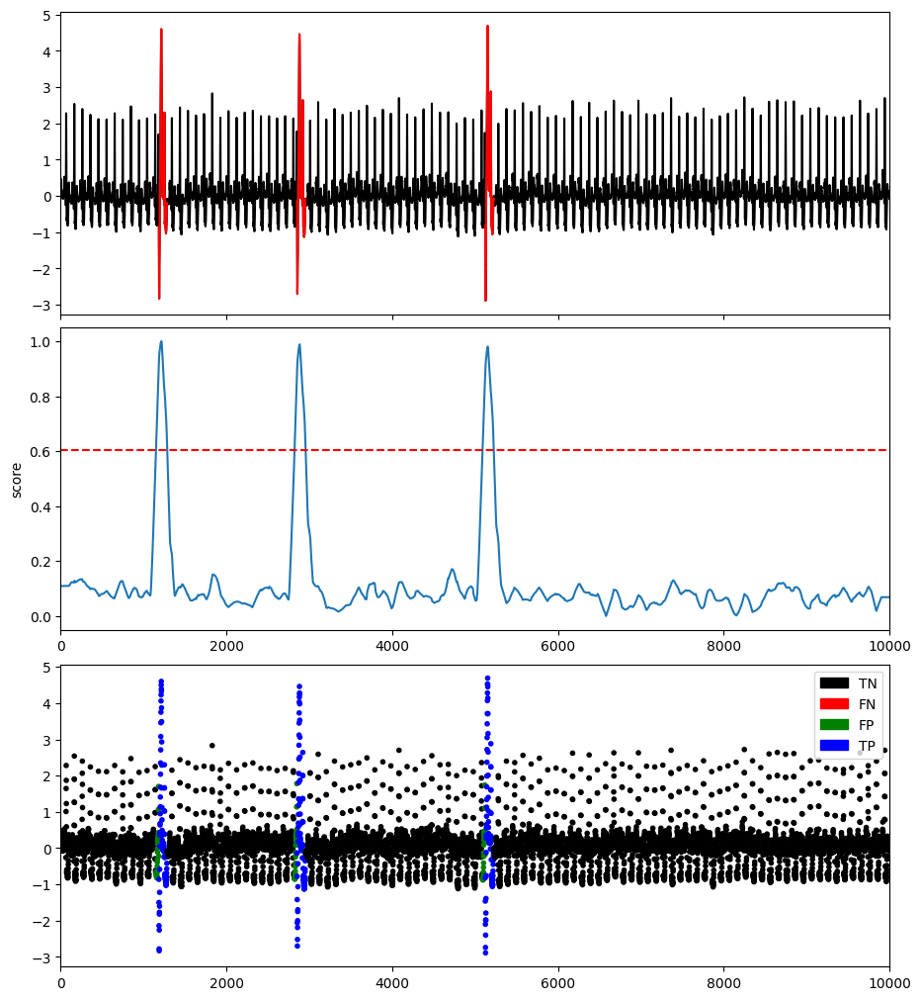

# Clustering-based methods

## NormA

NormA [Boniol and Linardi et al. 2021] is a clustering-based algorithm that summarizes the time series with a weighted set of sub-sequences. The normal set (weighted collection of sub-sequences to feature the training dataset) results from a clustering algorithm (Hierarchical), and the weights are derived from cluster properties (cardinality, extra-distance clustering, time coverage).

### Example

```python
import os
import numpy as np
import pandas as pd
from tsb_kit.utils.visualisation import plotFig
from tsb_kit.models.norma import NORMA
from tsb_kit.models.feature import Window
from tsb_kit.utils.slidingWindows import find_length
from tsb_kit.vus.metrics import get_metrics

#Read data
filepath = 'PATH_TO_TSB_UAD/ECG/MBA_ECG805_data.out'
df = pd.read_csv(filepath, header=None).dropna().to_numpy()
name = filepath.split('/')[-1]

data = df[:,0].astype(float)
label = df[:,1].astype(int)

#Pre-processing
slidingWindow = find_length(data)

# Run NormA
modelName='NORMA'
clf = NORMA(pattern_length = slidingWindow, nm_size=3*slidingWindow)
clf.fit(data)
score = clf.decision_scores_

#Post-processing
score = MinMaxScaler(feature_range=(0,1)).fit_transform(score.reshape(-1,1)).ravel()
score = np.array([score[0]]*math.ceil((slidingWindow-1)/2) + list(score) + [score[-1]]*((slidingWindow-1)//2))

#Plot result
plotFig(data, label, score, slidingWindow, fileName=name, modelName=modelName)

#Print accuracy
results = get_metrics(score, label, metric="all", slidingWindow=slidingWindow)
for metric in results.keys():
    print(metric, ':', results[metric])
```
```
AUC_ROC : 0.9979623516646807
AUC_PR : 0.932388006170981
Precision : 0.753731343283582
Recall : 1.0
F : 0.8595744680851063
Precision_at_k : 1.0
Rprecision : 0.7537313432835822
Rrecall : 1.0000000000000002
RF : 0.8595744680851066
R_AUC_ROC : 0.9997724221201816
R_AUC_PR : 0.994024737583278
VUS_ROC : 0.999568694352888
VUS_PR : 0.988052538139092
Affiliation_Precision : 0.9812433853440004
Affiliation_Recall : 1.0
```


### References

[Boniol and Linardi et al. 2021] P. Boniol, M. Linardi, F. Roncallo, T. Palpanas, M. Meftah, and E. Remy. Mar. 2021. Unsupervised and scalable subsequence anomaly detection in large data series. The VLDB Journal.

## SAND

SAND [Boniol and Paparrizos et al. 2021] is a clustering-based algorithm, and an adaptation of NormA for streaming time series. This method can be used either online and offline (it corresponds to set the inital batch to the length of the time series).
This method identifies the normal pattern based on clustering updated through arriving batches (i.e., subsequences) and calculates each point's effective distance to the normal pattern.

Please note that some functions of SAND are using Numba. Thus, means that the execution time might be slower for the first run.

```{eval-rst}  
.. autoclass:: tsb_kit.models.sand.SAND
    :members:

```

### Example with Offline mode (static time series)

```python
import os
import numpy as np
import pandas as pd
from tsb_kit.utils.visualisation import plotFig
from tsb_kit.models.sand import SAND
from tsb_kit.models.feature import Window
from tsb_kit.utils.slidingWindows import find_length
from tsb_kit.vus.metrics import get_metrics

#Read data
filepath = 'PATH_TO_TSB_UAD/ECG/MBA_ECG805_data.out'
df = pd.read_csv(filepath, header=None).dropna().to_numpy()
name = filepath.split('/')[-1]

data = df[:,0].astype(float)
label = df[:,1].astype(int)

#Pre-processing
slidingWindow = find_length(data)

# Run SAND (offline)
modelName='SAND (offline)'
clf = SAND(pattern_length=slidingWindow,subsequence_length=4*(slidingWindow))
clf.fit(data,overlaping_rate=int(1.5*slidingWindow))
score = clf.decision_scores_

#Post-processing
score = MinMaxScaler(feature_range=(0,1)).fit_transform(score.reshape(-1,1)).ravel()

#Plot result
plotFig(data, label, score, slidingWindow, fileName=name, modelName=modelName)

#Print accuracy
results = get_metrics(score, label, metric="all", slidingWindow=slidingWindow)
for metric in results.keys():
    print(metric, ':', results[metric])
```
```
AUC_ROC : 0.996779310807228
AUC_PR : 0.8942079947725918
Precision : 0.7393483709273183
Recall : 0.9735973597359736
F : 0.8404558404558404
Precision_at_k : 0.9735973597359736
Rprecision : 0.7394705860012913
Rrecall : 0.9790057437116261
RF : 0.8425439890952773
R_AUC_ROC : 0.9996748675955897
R_AUC_PR : 0.9911647851406946
VUS_ROC : 0.9993050973645579
VUS_PR : 0.9802087454821152
Affiliation_Precision : 0.9825340283920497
Affiliation_Recall : 1.0
```
 Result")

### Example with Online mode (streaming time series)

```python
import os
import numpy as np
import pandas as pd
from tsb_kit.utils.visualisation import plotFig
from tsb_kit.models.sand import SAND
from tsb_kit.models.feature import Window
from tsb_kit.utils.slidingWindows import find_length
from tsb_kit.vus.metrics import get_metrics

#Read data
filepath = 'PATH_TO_TSB_UAD/ECG/MBA_ECG805_data.out'
df = pd.read_csv(filepath, header=None).dropna().to_numpy()
name = filepath.split('/')[-1]

data = df[:,0].astype(float)
label = df[:,1].astype(int)

#Pre-processing
slidingWindow = find_length(data)

# Run SAND (online)
modelName='SAND (online)'
clf = SAND(pattern_length=slidingWindow,subsequence_length=4*(slidingWindow))
x = data
clf.fit(x,online=True,alpha=0.5,init_length=5000,batch_size=2000,verbose=True,overlaping_rate=int(4*slidingWindow))
score = clf.decision_scores_

#Post-processing
score = MinMaxScaler(feature_range=(0,1)).fit_transform(score.reshape(-1,1)).ravel()

#Plot result
plotFig(data, label, score, slidingWindow, fileName=name, modelName=modelName)

#Print accuracy
results = get_metrics(score, label, metric="all", slidingWindow=slidingWindow)
for metric in results.keys():
    print(metric, ':', results[metric])
```
```
AUC_ROC : 0.9952552437877592
AUC_PR : 0.8534825713191976
Precision : 0.5897435897435898
Recall : 0.9108910891089109
F : 0.7159533073929961
Precision_at_k : 0.9108910891089109
Rprecision : 0.6257139290992594
Rrecall : 0.9290948702713409
RF : 0.747805906448152
R_AUC_ROC : 0.9984211806490199
R_AUC_PR : 0.9662017062533563
VUS_ROC : 0.9980585809756719
VUS_PR : 0.9542280349659151
Affiliation_Precision : 0.9776035535846139
Affiliation_Recall : 0.9999950659680077
```
 Result")

### References

[Boniol and Paparrizos et al. 2021] P. Boniol, J. Paparrizos, T. Palpanas, and M. J. Franklin. 2021. Sand: streaming subsequence anomaly detection. PVLDB, 14(10): 1717–1729.