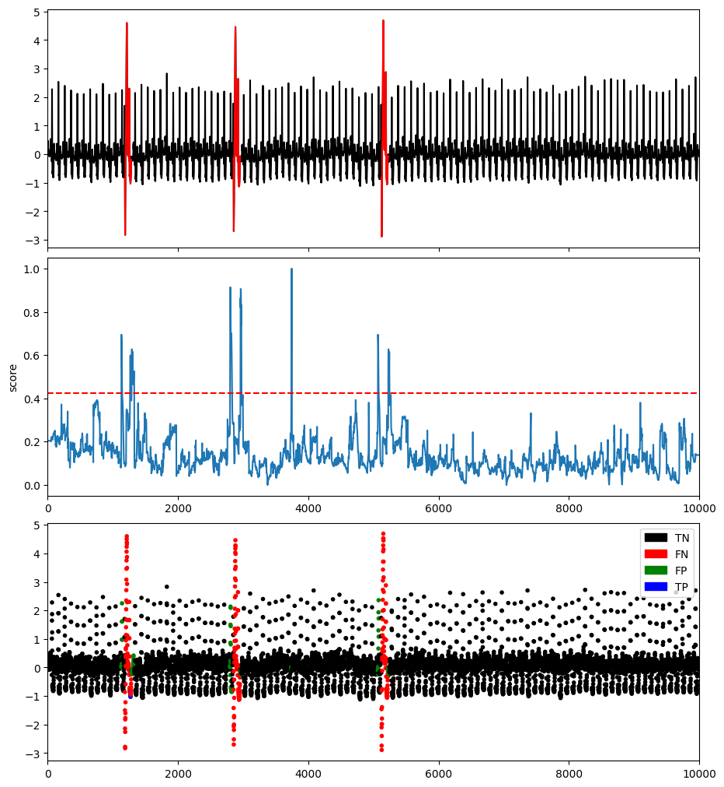
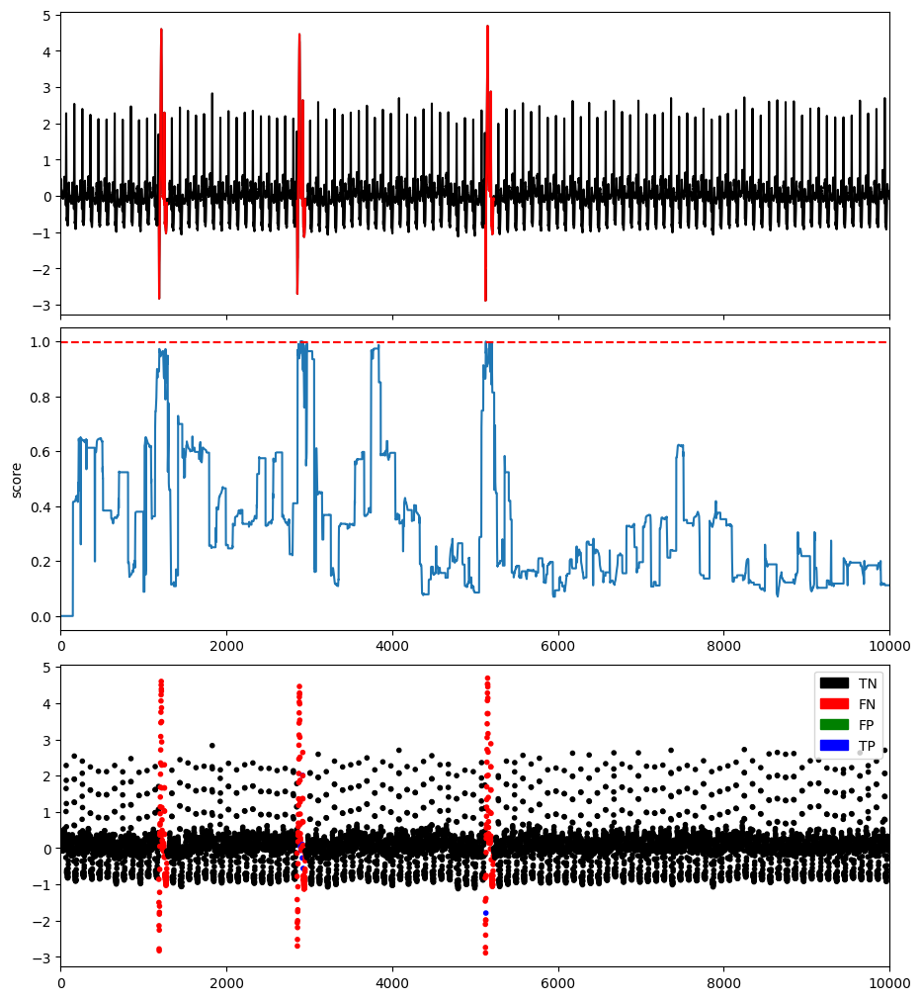

# Discord-based methods

## Matrix Profile

### Example

```python
import os
import numpy as np
import pandas as pd
from tsb_kit.utils.visualisation import plotFig
from tsb_kit.models.damp import DAMP
from tsb_kit.models.feature import Window
from tsb_kit.utils.slidingWindows import find_length
from tsb_kit.vus.metrics import get_metrics

#Read data
filepath = 'PATH_TO_TSB_UAD/ECG/MBA_ECG805_data.out'
df = pd.read_csv(filepath, header=None).dropna().to_numpy()
name = filepath.split('/')[-1]

data = df[:,0].astype(float)
label = df[:,1].astype(int)

# Run MatrixProfile
modelName='MatrixProfile'
clf = MatrixProfile(window = slidingWindow)
clf.fit(data)
score = clf.decision_scores_

#Post-processing
score = MinMaxScaler(feature_range=(0,1)).fit_transform(score.reshape(-1,1)).ravel()
score = np.array([score[0]]*math.ceil((slidingWindow-1)/2) + list(score) + [score[-1]]*((slidingWindow-1)//2))

#Plot result
plotFig(data, label, score, slidingWindow, fileName=name, modelName=modelName)

#Print accuracy
results = get_metrics(score, label, metric="all", slidingWindow=slidingWindow)
for metric in results.keys():
    print(metric, ':', results[metric])
```
```
AUC_ROC : 0.7968186887782313
AUC_PR : 0.09205761752802392
Precision : 0.058823529411764705
Recall : 0.0297029702970297
F : 0.039473684210526314
Precision_at_k : 0.0297029702970297
Rprecision : 0.125
Rrecall : 0.09090909090909093
RF : 0.10526315789473685
R_AUC_ROC : 0.9531611224056705
R_AUC_PR : 0.4926688922361494
VUS_ROC : 0.9186620929224953
VUS_PR : 0.39033909329157723
Affiliation_Precision : 0.9015749833720904
Affiliation_Recall : 0.9720951147963328
```


## DAMP

### Example

```python
import os
import numpy as np
import pandas as pd
from tsb_kit.utils.visualisation import plotFig
from tsb_kit.models.damp import DAMP
from tsb_kit.models.feature import Window
from tsb_kit.utils.slidingWindows import find_length
from tsb_kit.vus.metrics import get_metrics

#Read data
filepath = 'PATH_TO_TSB_UAD/ECG/MBA_ECG805_data.out'
df = pd.read_csv(filepath, header=None).dropna().to_numpy()
name = filepath.split('/')[-1]

data = df[:,0].astype(float)
label = df[:,1].astype(int)

# Run DAMP
modelName='DAMP'
clf = DAMP(m = slidingWindow,sp_index=slidingWindow+1)
clf.fit(data)
score = clf.decision_scores_

#Post-processing
score = MinMaxScaler(feature_range=(0,1)).fit_transform(score.reshape(-1,1)).ravel()
score = np.array([score[0]]*math.ceil((slidingWindow-1)/2) + list(score) + [score[-1]]*((slidingWindow-1)//2))

#Plot result
plotFig(data, label, score, slidingWindow, fileName=name, modelName=modelName)

#Print accuracy
results = get_metrics(score, label, metric="all", slidingWindow=slidingWindow)
for metric in results.keys():
    print(metric, ':', results[metric])
```
```
AUC_ROC : 0.9796517653209067
AUC_PR : 0.5354674121425284
Precision : 1.0
Recall : 0.0462046204620462
F : 0.08832807570977919
Precision_at_k : 0.0462046204620462
Rprecision : 1.0
Rrecall : 0.1427450980392157
RF : 0.24982841455044613
R_AUC_ROC : 0.9861962693093778
R_AUC_PR : 0.6140113439366928
VUS_ROC : 0.9813282886141234
VUS_PR : 0.5943507237860649
Affiliation_Precision : 0.6162807136520358
Affiliation_Recall : 0.9999402806808003
```
