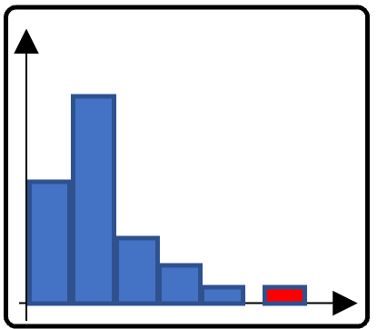
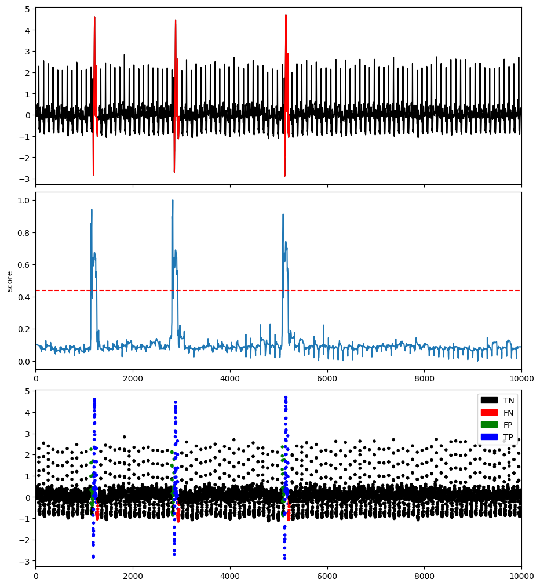

# Distribution-based methods

## One-Class Support Vector Machine (OCSVM)

This method fits the dataset to find the normal data's boundary.

### Example

```python
import os
import numpy as np
import pandas as pd
from tsb_kit.utils.visualisation import plotFig
from tsb_kit.models.ocsvm import OCSVM
from tsb_kit.models.feature import Window
from tsb_kit.utils.slidingWindows import find_length
from tsb_kit.vus.metrics import get_metrics

#Read data
filepath = 'PATH_TO_TSB_UAD/ECG/MBA_ECG805_data.out'
df = pd.read_csv(filepath, header=None).dropna().to_numpy()
name = filepath.split('/')[-1]

data = df[:,0].astype(float)
label = df[:,1].astype(int)

#Pre-processing    
slidingWindow = find_length(data)
data_train = data[:int(0.1*len(data))]
data_test = data

X_train = Window(window = slidingWindow).convert(data_train).to_numpy()
X_test = Window(window = slidingWindow).convert(data_test).to_numpy()

X_train_ = MinMaxScaler(feature_range=(0,1)).fit_transform(X_train.T).T
X_test_ = MinMaxScaler(feature_range=(0,1)).fit_transform(X_test.T).T


#Run OCSVM
modelName='OCSVM'
clf = OCSVM(nu=0.05)
clf.fit(X_train_, X_test_)
score = clf.decision_scores_

# Post-processing
score = np.array([score[0]]*math.ceil((slidingWindow-1)/2) + list(score) + [score[-1]]*((slidingWindow-1)//2))
score = MinMaxScaler(feature_range=(0,1)).fit_transform(score.reshape(-1,1)).ravel()

#Plot result
plotFig(data, label, score, slidingWindow, fileName=name, modelName=modelName) 

#Print accuracy
results = get_metrics(score, label, metric="all", slidingWindow=slidingWindow)
for metric in results.keys():
    print(metric, ':', results[metric])
```
```
AUC_ROC : 0.9416967787322199
AUC_PR : 0.4592289027872978
Precision : 0.6402266288951841
Recall : 0.7458745874587459
F : 0.6890243902439025
Precision_at_k : 0.7458745874587459
Rprecision : 0.4007206588881263
Rrecall : 0.7967914438502675
RF : 0.5332568942659819
R_AUC_ROC : 0.9983442451461604
R_AUC_PR : 0.9119783238745204
VUS_ROC : 0.9905101824629529
VUS_PR : 0.8021253491270806
Affiliation_Precision : 0.9798093961448288
Affiliation_Recall : 0.9970749874410433
```


## Histogram-based Outlier Score (HBOS)

This method constructs a histogram for the data and the inverse of the height of the bin is used as the outlier score of the data point.

### Example