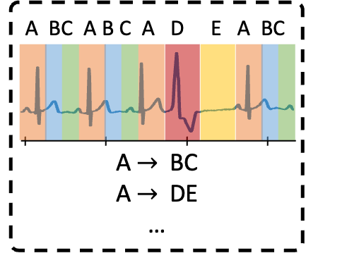
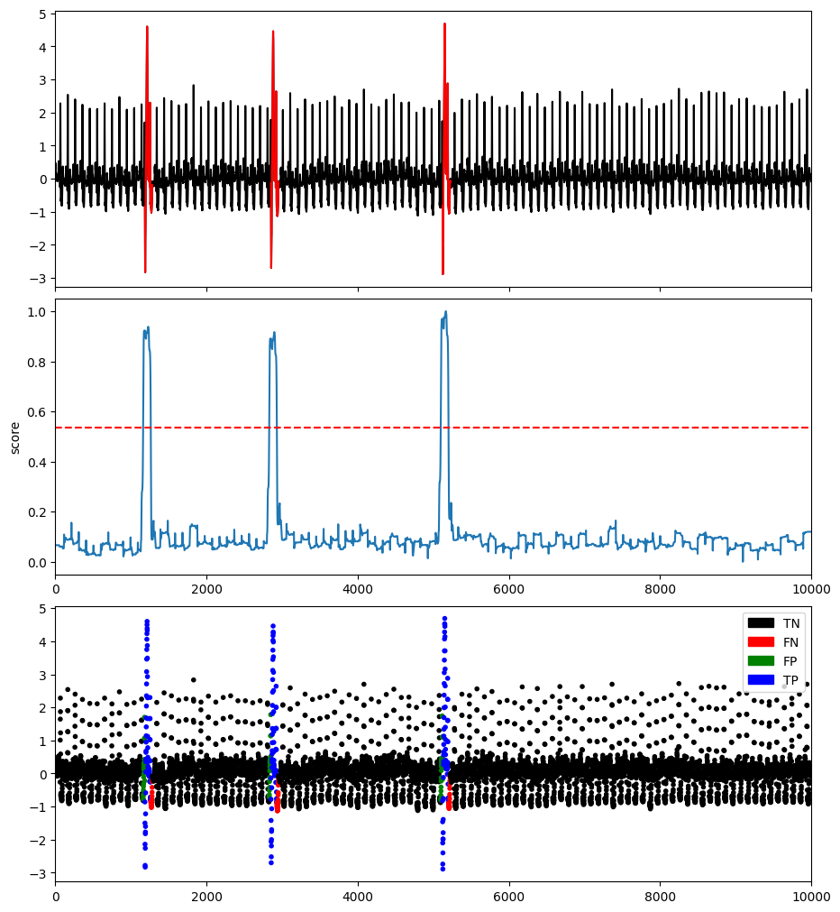
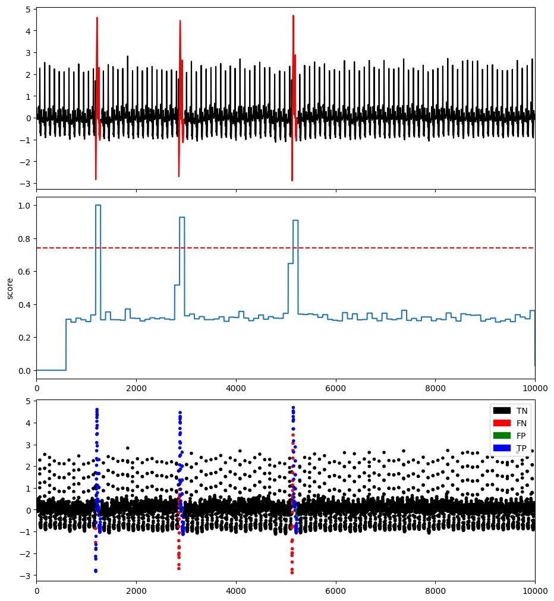

# Encoding-based methods

## Principal Component Analysis-based Anomaly Detection (PCA)

This method projects data to a lower-dimensional hyperplane, and data points with a significant distance from this plane can be identified as outliers.

### Example

```python
import os
import numpy as np
import pandas as pd
from tsb_kit.utils.visualisation import plotFig
from tsb_kit.models.pca import PCA
from tsb_kit.models.feature import Window
from tsb_kit.utils.slidingWindows import find_length
from tsb_kit.vus.metrics import get_metrics

#Read data
filepath = 'PATH_TO_TSB_UAD/ECG/MBA_ECG805_data.out'
df = pd.read_csv(filepath, header=None).dropna().to_numpy()
name = filepath.split('/')[-1]

data = df[:,0].astype(float)
label = df[:,1].astype(int)

#Pre-processing    
slidingWindow = find_length(data)
X_data = Window(window = slidingWindow).convert(data).to_numpy()


#Run PCA
modelName='PCA'
clf = PCA()
clf.fit(X_data)
score = clf.decision_scores_

# Post-processing
score = MinMaxScaler(feature_range=(0,1)).fit_transform(score.reshape(-1,1)).ravel()
score = np.array([score[0]]*math.ceil((slidingWindow-1)/2) + list(score) + [score[-1]]*((slidingWindow-1)//2))


#Plot result
plotFig(data, label, score, slidingWindow, fileName=name, modelName=modelName) 

#Print accuracy
results = get_metrics(score, label, metric="all", slidingWindow=slidingWindow)
for metric in results.keys():
    print(metric, ':', results[metric])
```
```
AUC_ROC : 0.9831757023284056
AUC_PR : 0.7572161269856095
Precision : 0.7752442996742671
Recall : 0.7854785478547854
F : 0.7803278688524591
Precision_at_k : 0.7854785478547854
Rprecision : 0.77530626365804
Rrecall : 0.8284808873044168
RF : 0.8010120555743515
R_AUC_ROC : 0.9994595750446229
R_AUC_PR : 0.9836739288859631
VUS_ROC : 0.997118940672939
VUS_PR : 0.9475589866373976
Affiliation_Precision : 0.9890337001400605
Affiliation_Recall : 0.9982808225194953
```


## Polynomial Approximation (POLY)

This method build a non-linear relationship between current and previous time series (using polynomial decomposition), and the outliers are detected by the deviation between the predicted and actual values.

### Example

```python
import os
import numpy as np
import pandas as pd
from tsb_kit.utils.visualisation import plotFig
from tsb_kit.models.distance import Fourier
from tsb_kit.models.poly import POLY
from tsb_kit.models.feature import Window
from tsb_kit.utils.slidingWindows import find_length
from tsb_kit.vus.metrics import get_metrics

#Read data
filepath = 'PATH_TO_TSB_UAD/ECG/MBA_ECG805_data.out'
df = pd.read_csv(filepath, header=None).dropna().to_numpy()
name = filepath.split('/')[-1]

data = df[:,0].astype(float)
label = df[:,1].astype(int)

#Pre-processing    
slidingWindow = find_length(data)


#Run POLY
modelName='POLY'
clf = POLY(power=3, window = slidingWindow)
clf.fit(data)
measure = Fourier()
measure.detector = clf
measure.set_param()
clf.decision_function(measure=measure)
score = clf.decision_scores_

# Post-processing
score = MinMaxScaler(feature_range=(0,1)).fit_transform(score.reshape(-1,1)).ravel()

#Plot result
plotFig(data, label, score, slidingWindow, fileName=name, modelName=modelName) 

#Print accuracy
results = get_metrics(score, label, metric="all", slidingWindow=slidingWindow)
for metric in results.keys():
    print(metric, ':', results[metric])
```
```
AUC_ROC : 0.9958617394172128
AUC_PR : 0.8837102941063337
Precision : 0.8686868686868687
Recall : 0.8514851485148515
F : 0.86
Precision_at_k : 0.8514851485148515
Rprecision : 0.8686868686868686
Rrecall : 0.8821944939591999
RF : 0.875388577295774
R_AUC_ROC : 0.9966496859473177
R_AUC_PR : 0.9632279391916059
VUS_ROC : 0.9939772090687404
VUS_PR : 0.9465631009222253
Affiliation_Precision : 0.9810555530560522
Affiliation_Recall : 0.9999934905686477
```
