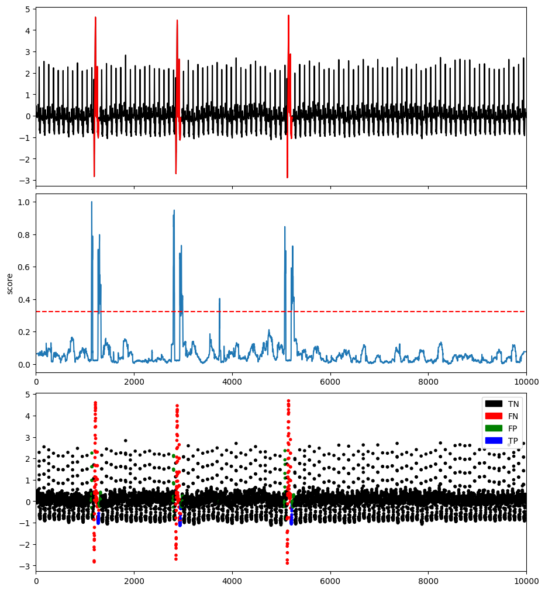

# Proximity-based methods

## Local Outlier Factor (LOF)

### Example

```python
import os
import numpy as np
import pandas as pd
from tsb_kit.utils.visualisation import plotFig
from tsb_kit.models.lof import LOF
from tsb_kit.models.feature import Window
from tsb_kit.utils.slidingWindows import find_length
from tsb_kit.vus.metrics import get_metrics

#Read data
filepath = 'PATH_TO_TSB_UAD/ECG/MBA_ECG805_data.out'
df = pd.read_csv(filepath, header=None).dropna().to_numpy()
name = filepath.split('/')[-1]

data = df[:,0].astype(float)
label = df[:,1].astype(int)

#Pre-processing    
slidingWindow = find_length(data)
X_data = Window(window = slidingWindow).convert(data).to_numpy()

# Run LOF
modelName='LOF'
clf = LOF(n_neighbors=20, n_jobs=1)
clf.fit(X_data)
score = clf.decision_scores_

#Post-processing
score = MinMaxScaler(feature_range=(0,1)).fit_transform(score.reshape(-1,1)).ravel()
score = np.array([score[0]]*math.ceil((slidingWindow-1)/2) + list(score) + [score[-1]]*((slidingWindow-1)//2))


#Plot result
plotFig(data, label, score, slidingWindow, fileName=name, modelName=modelName)

#Print accuracy
results = get_metrics(score, label, metric="all", slidingWindow=slidingWindow)
for metric in results.keys():
    print(metric, ':', results[metric])
```
```
AUC_ROC : 0.41096068975774547
AUC_PR : 0.048104473111295544
Precision : 0.21794871794871795
Recall : 0.16831683168316833
F : 0.1899441340782123
Precision_at_k : 0.16831683168316833
Rprecision : 0.3095238095238095
Rrecall : 0.304812834224599
RF : 0.3071502590673575
R_AUC_ROC : 0.6916553096198312
R_AUC_PR : 0.4549204085910081
VUS_ROC : 0.6545868021121983
VUS_PR : 0.35228784121262147
Affiliation_Precision : 0.942248287092041
Affiliation_Recall : 0.978882103900466
```
