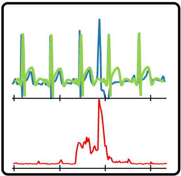
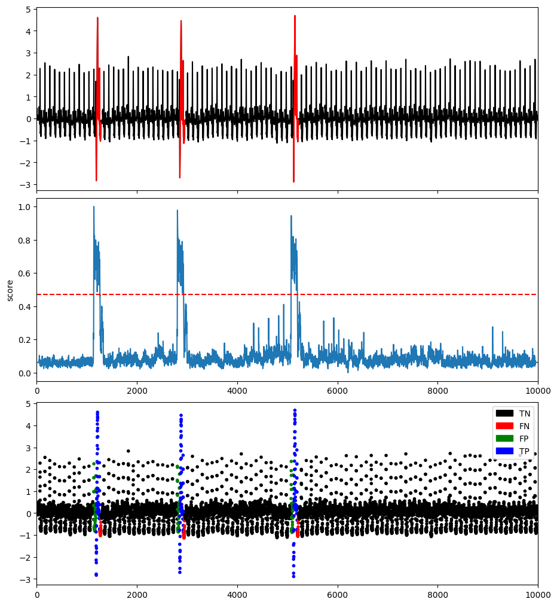

# Reconstruction-based methods

## AutoEncoder (AE)

This method projects data to the lower-dimensional latent space and reconstructs the data, and outliers are expected to have more evident reconstruction deviation.

### Example

```python
import os
import numpy as np
import pandas as pd
from tsb_kit.utils.visualisation import plotFig
from tsb_kit.models.AE import AE_MLP2
from tsb_kit.models.feature import Window
from tsb_kit.utils.slidingWindows import find_length
from tsb_kit.vus.metrics import get_metrics

#Read data
filepath = 'PATH_TO_TSB_UAD/ECG/MBA_ECG805_data.out'
df = pd.read_csv(filepath, header=None).dropna().to_numpy()
name = filepath.split('/')[-1]

data = df[:,0].astype(float)
label = df[:,1].astype(int)

#Pre-processing    
slidingWindow = find_length(data)

data_train = data[:int(0.1*len(data))]
data_test = data


#Run AE
modelName='AE'
clf = AE_MLP2(slidingWindow = slidingWindow, epochs=100, verbose=0)
clf.fit(data_train, data_test)
score = clf.decision_scores_

# Post-processing
score = MinMaxScaler(feature_range=(0,1)).fit_transform(score.reshape(-1,1)).ravel()
#Plot result
plotFig(data, label, score, slidingWindow, fileName=name, modelName=modelName) 

#Print accuracy
results = get_metrics(score, label, metric="all", slidingWindow=slidingWindow)
for metric in results.keys():
    print(metric, ':', results[metric])
```
```
AUC_ROC : 0.9798903474961295
AUC_PR : 0.4527029967265067
Precision : 0.6266666666666667
Recall : 0.7755775577557755
F : 0.6932153392330384
Precision_at_k : 0.7755775577557755
Rprecision : 0.7192460317460317
Rrecall : 0.717211328976035
RF : 0.7182272393104755
R_AUC_ROC : 0.9983630797681471
R_AUC_PR : 0.9097203186257167
VUS_ROC : 0.9948961110972894
VUS_PR : 0.7985717813531896
Affiliation_Precision : 0.9784117321775244
Affiliation_Recall : 0.9979366661199016
```


