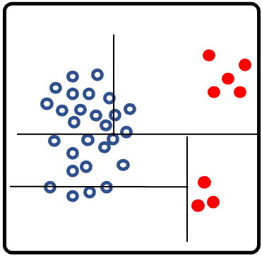
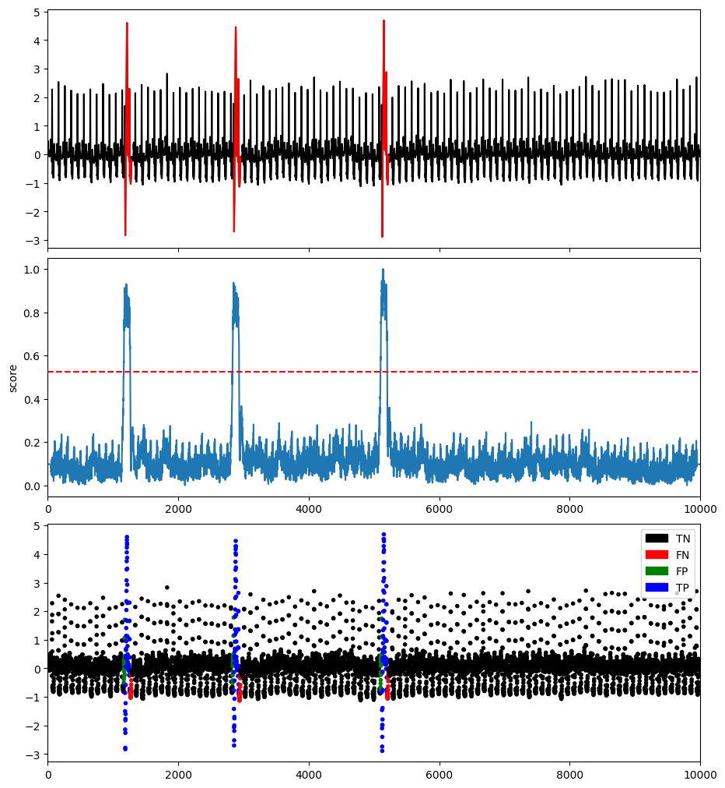

# Tree-based methods


## Isolation Forest

This method constructs the binary tree based on the space splitting and the nodes with shorter path lengths to the root are more likely to be anomalies.

### Example

Here is a code snippet that shows how to run Isolation Forest.

```python
import os
import numpy as np
import pandas as pd
from tsb_kit.utils.visualisation import plotFig
from tsb_kit.models.iforest import IForest
from tsb_kit.models.feature import Window
from tsb_kit.utils.slidingWindows import find_length
from tsb_kit.vus.metrics import get_metrics

#Read data
filepath = 'PATH_TO_TSB_UAD/ECG/MBA_ECG805_data.out'
df = pd.read_csv(filepath, header=None).dropna().to_numpy()
name = filepath.split('/')[-1]

data = df[:,0].astype(float)
label = df[:,1].astype(int)

#Pre-processing    
slidingWindow = find_length(data)
X_data = Window(window = slidingWindow).convert(data).to_numpy()


#Run IForest
modelName='IForest'
clf = IForest(n_jobs=1)
x = X_data
clf.fit(x)
score = clf.decision_scores_

# Post-processing
score = MinMaxScaler(feature_range=(0,1)).fit_transform(score.reshape(-1,1)).ravel()
score = np.array([score[0]]*math.ceil((slidingWindow-1)/2) + list(score) + [score[-1]]*((slidingWindow-1)//2))

#Plot result
plotFig(data, label, score, slidingWindow, fileName=name, modelName=modelName) 

#Print accuracy
results = get_metrics(score, label, metric="all", slidingWindow=slidingWindow)
for metric in results.keys():
    print(metric, ':', results[metric])
```
```
AUC_ROC : 0.9216216369841076
AUC_PR : 0.6608577550833885
Precision : 0.7342093339374717
Recall : 0.4010891089108911
F : 0.5187770129662238
Precision_at_k : 0.4010891089108911
Rprecision : 0.7486112853253205
Rrecall : 0.3097733542316151
RF : 0.438214653167952
R_AUC_ROC : 0.989123018780308
R_AUC_PR : 0.9435238401582703
VUS_ROC : 0.9734357459251715
VUS_PR : 0.8858037295594041
Affiliation_Precision : 0.9630674176380548
Affiliation_Recall : 0.9809813654809071
```


