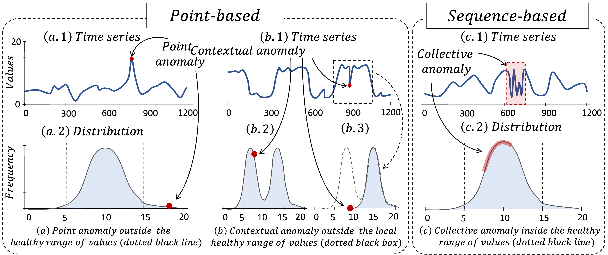

# Introduction

Recent advances in data collection technology, accompanied by the ever-rising volume and velocity of streaming data, underscore the vital need for time-series analytics. In this regard, time-series anomaly detection has been an important task, entailing various applications in fields such as cyber security, financial markets, and health care. While traditional literature on anomaly detection is centered on statistical measures, the increasing number of machine learning algorithms in recent years call for a structured, general characterization of the research methods for time-series anomaly detection. 

The objective of TSB-kit is to provide simple and easy implementations of the main methods proposed in the literature. To do so, we porpose a novel process-centric taxonomy in the time series context and pick representatives for each categories. 

## On the Definition of Anomalies in Time Series

Attesting to the challenging nature of the problem at hand, we observe that there does not exist a single, universal, precise definition of anomalies or outliers. Traditionally, anomalies are observations that deviate considerably from the majority of other samples in a distribution. The anomalous points raise suspicions that a mechanism different from those of the other data generated the specific observation. Such a mechanism usually represents either an erroneous data measurement procedure, or an unusual event; both these cases are interesting to the analysts.

## Subsequence versus Points: a Core Difference

There is a further complication in time-series anomaly detection. Due to the temporality of the data, anomalies can occur in the form of a single value or collectively in the form of subsequences. In the specific context of point, we are interested in finding points that are far from the usual distribution of values that correspond to healthy states. In the specific context of sequences, we are interested in identifying anomalous subsequences, which are usually not outliers but exhibit rare and, hence, anomalous patterns. In real-world applications, such a distinction between points and subsequences becomes crucial because even though individual points might seem normal against their neighboring points, the shape generated by the sequence of these points may be anomalous.

Formally, we define three types of time series anomalies: point, contextual, and collective anomalies. Point anomalies refer to data points that deviate remarkably from the rest of the data. Contextual anomalies refer to data points within the expected range of the distribution (in contrast to point anomalies) but deviate from the expected data distribution, given a specific context (e.g., a window). Collective anomalies refer to sequences of points that do not repeat a typical (previously observed) pattern. The first two categories, namely, point and contextual anomalies, are referred to as point-based anomalies. whereas, collective anomalies are referred to as sequence-based anomalies.

## What about Multivariate Anomalies?

Another characteristic of time-series anomalies comes from the dimensionality of the data. Univariate time series consists of an ordered sequence of real values on a single dimension, and the anomalies are detected based on one single dimension (or feature). 
On the other hand, Multivariate time series is either a set of ordered sequences of real values (with each ordered sequence having the same length) or an ordered sequence of vectors composed of real values. 

In TSB-kit, we only focus on univariate time series anoamly deteciton.

## Detecting Anomalies in Time Series: a Generic Pipeline

The various different algorithms proposed for anomaly detection in time series usually follow the same pipeline. This pipeline consists of four parts: data pre-processing, detection method, scoring, and post-processing. The decomposition of the general anomaly detection process into small steps of a pipeline is beneficial for comparing different algorithms on various dimensions.

We provide with TSB-kit function to preprocess the time seires, to run the methods and compute their anoamly scores, and to post-process them.